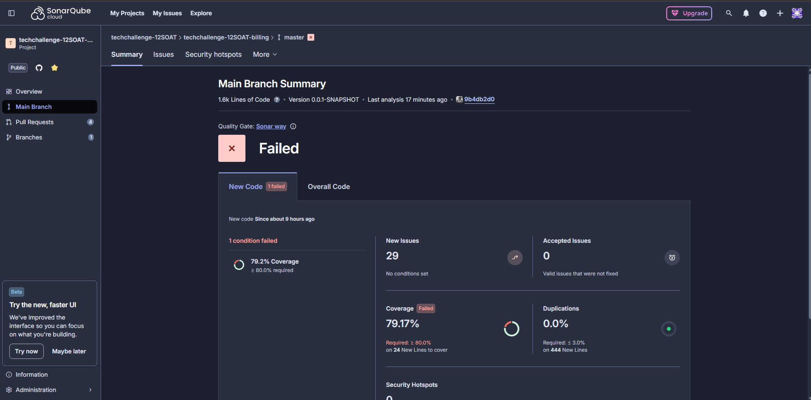

# POS TECH - Tech Challenge: Microsserviço de Billing (Faturamento)

Este repositório contém o código-fonte e os manifestos de deploy do **Microsserviço de Billing**, parte integrante do ecossistema de serviços do **Tech Challenge (Fase 4)**. O projeto foi desenvolvido com o objetivo de gerenciar o fluxo de pagamentos, integração com gateways externos e comunicação de status de transações.

O sistema foi modelado utilizando a metodologia **Clean Architecture**, garantindo desacoplamento entre a lógica de negócio e as ferramentas externas (Gateways, Banco de Dados, Mensageria). A aplicação é um microsserviço desenvolvido em **Java 21** e **Spring Boot 4**, expondo APIs **RESTful** e integrando-se de forma assíncrona para processamento de notificações.

O foco deste repositório é a gestão do ciclo de vida de pagamentos, desde a criação de preferências de checkout até a conciliação via webhooks e mensageria.

### Tecnologias e Recursos da AWS

*   **Java 21 & Spring Boot:** Base da aplicação para alta performance e produtividade.
*   **MongoDB:** Banco de dados NoSQL para persistência flexível de transações e logs de pagamento.
*   **Mercado Pago SDK:** Integração nativa para geração de links de pagamento e processamento de checkout.
*   **AWS SQS:** Filas para recebimento de notificações de pagamento, permitindo processamento assíncrono e resiliente.
*   **AWS SNS:** Tópicos para publicação de eventos de domínio, como **PaymentApproved** e **PaymentFailed**, notificando outros microsserviços.
*   **AWS ECR:** Armazenamento da imagem Docker da aplicação.
*   **Kubernetes (EKS):** Orquestração dos containers (Deployment, Service, HPA) com suporte a escalabilidade automática.

### Swagger
A documentação da API de faturamento está disponível via Swagger, permitindo visualizar e testar endpoints como a criação de checkout e consulta de status. Para acessar a documentação:

http://localhost:8080/swagger-ui/index.html

### Principais Endpoints
*   `POST /api/v1/checkout/mercadopago`: Gera link de pagamento para uma Ordem de Serviço.
*   `GET /api/v1/checkout/order/{serviceOrderId}`: Consulta o status do pagamento pelo ID da Ordem de Serviço.
*   `POST /api/v1/webhooks/mercadopago`: Recebe notificações assíncronas (webhooks) do gateway de pagamento.

### Evidência do SonarCloud funcionando

